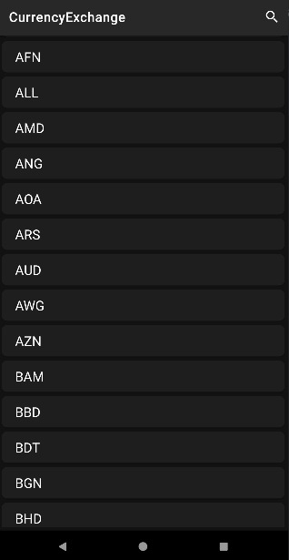
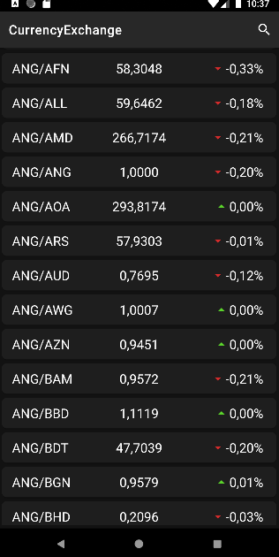

Release build: https://drive.google.com/drive/folders/1huAq1nynToU4BCyBPMCMFZsrkAKRDLqb?usp=sharing

CV: https://djinni.co/q/81e178a9b2/

api https://openexchangerates.org/

This app get currency list and exchange rate from api and store downloaded data
in database. By clicking on currency - shows all exchange pairs with fluctuation.
all items can be searched by find in toolbar

